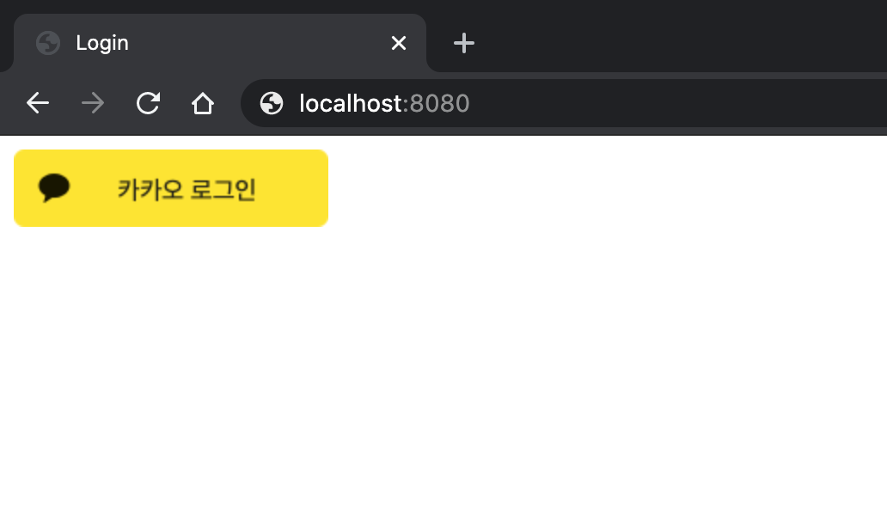
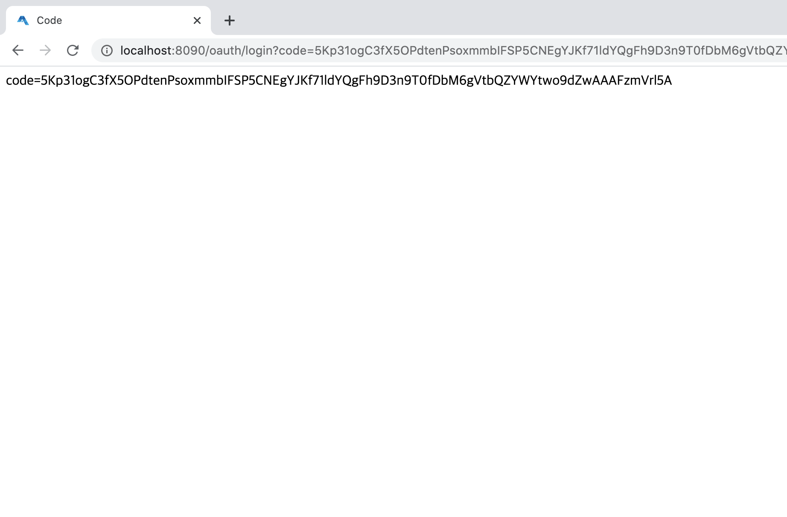
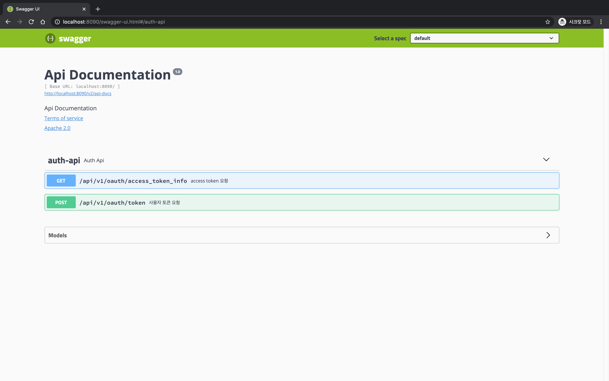
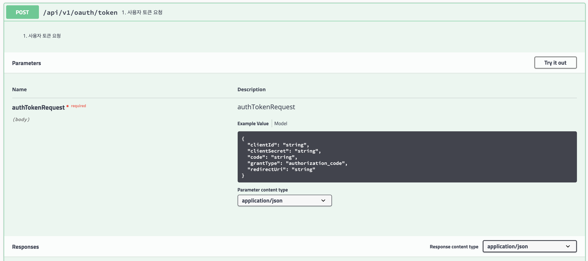
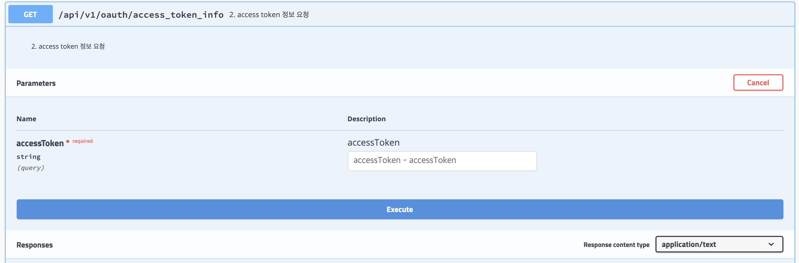
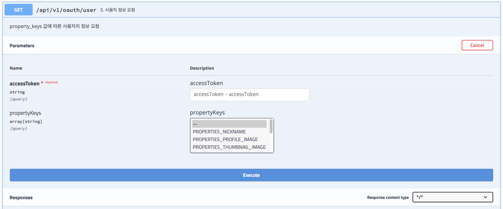

# 카카오 로그인 API

## Reference
[카카오 로그인](https://developers.kakao.com/docs/latest/ko/kakaologin/rest-api)

## 프로젝트 설정
`application.properties` 설정

```shell script
kakao.oauth.login.redirectUrl=YOUR_REDIRECT_URI  # 로그인 버튼 누르고 redirect 되는 uri
kakao.oauth.appKey=YOUR_APP_KEY
```
## 1. 카카오 로그인 및 인증코드 받기
1. `http://localhost:8080` 접속하고 로그인 버튼을 클릭하면 카카오 로그인 페이지가 나타납니다. 


2. 로그인 후에는 인증 코드가 발급 됩니다. 발급 받은 인증 코드를 복사 해 둡니다. (인증 코드를 발급 받았다고 로그인 과정이 완료된 것은 아닙니다.)


## 2. Swagger-ui 로 api 호출하기
`http://localhost:8080/swagger-ui.html` 접속하면 세 가지를 요청할 수 있는 API 가 있습니다.

### 2-1. 사용자 토큰 요청
로그인을 완료하기 위해서는 앞서 발급 받은 인증 코드로 사용자 토큰을 요청해야 합니다. 사용자 토큰 받기를 통해 발급 받은 사용자 토큰은 `사용자 정보 요청`과 같은
사용자 기반 API를 호출할 때 사용합니다. 요청에 필요한 필수 파라미터를 넣고 실행하면 다음과 같은 응답을 받습니다.

결과예시:
```json
{
  "access_token": "RKpZsOdetJMJaSLtOMy_JXGdjVux-pTa7u8uuQo9cxcAAA",
  "token_type": "bearer",
  "refresh_token": "57npoqEjnzQRt86z9_A7QJii_QjDUresif3_pQo9cxcAAA",
  "expires_in": 21599,
  "scope": "profile",
  "refresh_token_expires_in": 5183999
}
```
### 2-2. Access token 정보 요청
앞서 발급 받은 access token 에 대한 정보를 요청 합니다. 해당 토큰의 유효성 검증이나 부가 정보를 얻기 위해 호출 합니다.

결과예시:
```json
{
  "id": 123456789,
  "expiresInMillis": 18121558,
  "expires_in": 18121,
  "app_id": 12345,
  "appId": 12345
}
```
### 2-3. 사용자 정보 요청
발급 받은 access token 이나 admin key 를 가지고 사용자에 대한 부가 정보를 요청할 수 있습니다. 이 때, `property_keys` 를 파라미터로 원하는 정보만 요청이 가능 합니다. (여러개의 property_key를 파라미터로 전송 가능합니다.)
property_keys 가 없으면 사용자의 모든 정보를 가져옵니다. 예제에서는 property_key 로 'kakao_acount.email' 을 요청한 결과입니다.   
[property_keys 파라미터 정보](https://developers.kakao.com/docs/latest/ko/user-mgmt/rest-api)

결과예시:
```json
{
  "id": 123456789,
  "connected_at": "2020-07-29T07:56:54Z",
  "kakao_account": {
    "has_email": true,
    "email_needs_agreement": false,
    "is_email_valid": true,
    "is_email_verified": true,
    "email": "xxxxxxxxx@gmail.com"
  }
}
```
