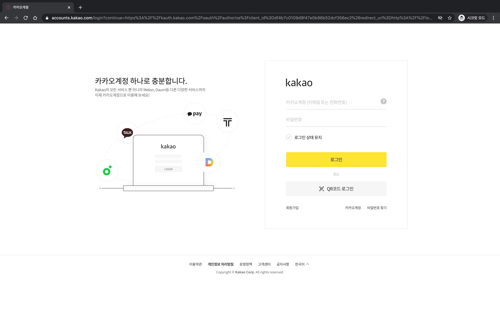

# 카카오 로그인 API

## Reference
[카카오 로그인](https://developers.kakao.com/docs/latest/ko/kakaologin/rest-api)

## 프로젝트 설정
`application.properties` 설정

```$shell
kakao.oauth.login.redirectUrl=YOUR_REDIRECT_URI  # 로그인 버튼 누르고 redirect 되는 uri
kakao.oauth.appKey=YOUR_APP_KEY
```
## 프로젝트 실행
#### 1. `http://localhost:8080` 접속

   
#### 2. 로그인 버튼을 클릭하면 로그인 화면으로 이동


#### 3. 로그인 후 인증 코드를 받음


#### 4. `http://localhost:8080/swagger-ui.html` 접속


#### 5. `사용자 토큰 요청` 부터 시도. 필수 파라미터를 채워 넣고 실행.   
#### 6. 실행 후 받아오는 `access_token` 을 가지고 `access token 정보 요청` 실행.  
#### 7. access token 정보 받음
#### 8. 사용자 정보 요청
header 에 `access_token` 정보를 담아 `property_keys` 를 매개로 사용자의 정보를 요청 합니다.
https://developers.kakao.com/docs/latest/ko/user-mgmt/rest-api#req-user-info
##### 결과:
```json
{
  "id": 123456789,
  "connected_at": "2020-07-29T07:56:54Z",
  "kakao_account": {
    "has_email": true,
    "email_needs_agreement": false,
    "is_email_valid": true,
    "is_email_verified": true,
    "email": "xxxxxxxxx@gmail.com"
  }
}
```
